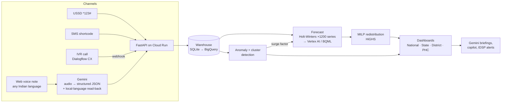

# PHC Pulse: a heartbeat for every health centre in India

**Build with AI: Code for Communities (Second Edition) · Problem Statement 03: Smart Health & Supply Chain Resilience**

> **In brief (submission description):** PHC Pulse gives every Primary Health Centre a
> one-minute daily report by voice (in the worker's own language), USSD, SMS or IVR. Gemini turns
> it into structured data. Per-PHC, per-drug forecasts then flag stock-outs 2+ weeks ahead,
> outbreak footfall spikes are detected automatically, and a MILP optimiser recommends which PHC
> should ship what to whom, with one-tap approval and delivery tracking.

---

## What works end to end

| Deck promise | Where it is in the prototype |
|---|---|
| **Voice-first reporting, < 60 s, own language** | `Voice report` page. Record up to 60 s; **Gemini** (multimodal audio) returns transcript + English translation + validated structured report, reads the numbers back in the worker's language, and asks a follow-up question for anything missing. 8 languages (hi, ta, kn, or, te, bn, mr, en). |
| **Feature phones: USSD / SMS / IVR** | `USSD · SMS · IVR` page: working `*123#` USSD menu (Africa's Talking-style gateway protocol), SMS shortcode grammar (`PCM 120 ORS 40 BED 4`), and a **Dialogflow CX** webhook for IVR calls. |
| **Demand forecasting, stock-outs flagged 2-3 weeks ahead** | Damped Holt-Winters per PHC × drug (1,200 series, vectorised). A warning fires when projected stock hits zero *before the next scheduled indent*. **Walk-forward backtest: 81% of real stock-outs flagged ≥ 14 days ahead** (67% precision, 79% weekly accuracy). Shown on `Models & HMIS`. |
| **Redistribution recommender under transport-cost constraints** | Mixed-integer program (HiGHS): trip cost (fixed + ₹/km + inter-state paperwork), urgency- and criticality-weighted shortage penalty, donor safety stock, **multi-drug consolidation per lane**. Produces the deck's own example: *"PHC-14 has surplus paracetamol; PHC-22 needs it in 9 days."* |
| **One-tap approval → delivery tracking** | `Redistribution` page: Approve → Dispatch → Delivered. Stock moves out of the donor's ledger and into the recipient's, and forecasts recompute instantly. |
| **Outbreak anomaly detection** | Weekday-adjusted robust z-scores on fever / diarrhoea / respiratory footfall; ≥ 2 PHCs within 50 km → cluster. Detects the seeded Koraput diarrhoea and Gorakhpur fever clusters. **Gemini drafts the IDSP alert** in English + the local language. Linked drugs (ORS/zinc, paracetamol/ACT) get outbreak-adjusted forecasts. |
| **District / State / National dashboards** | `Command centre` with map, KPIs, resilience scores, district roll-up, **Gemini daily briefing** in 5 languages and an **Ask Pulse** copilot grounded in the live snapshot. |
| **Row-level access by jurisdiction** | Signed role tokens: national, state, district (DHO) and PHC personas. Every API filters rows by scope and a DHO cannot widen it (mirrors BigQuery row access policies in `bigquery/schema.sql`). |
| **HMIS-compatible** | Facilities keyed by HMIS NIN; monthly HMIS-style CSV export (OPD, syndromic counts, receipts, consumption, closing balance, stock-out days). |
| **Scales state by state** | Engine decomposes the MILP per state (cross-state lanes are a Phase-3 toggle); BigQuery schema is partitioned by day and clustered by state; BQML / Vertex AI training scripts included. |

## Architecture



```
backend/app/
  seed.py            synthetic-but-realistic HMIS-like history (120 PHCs, 8 districts, 4 states, 180 days)
  forecasting.py     vectorised damped Holt-Winters + walk-forward backtest
  anomaly.py         robust weekday-adjusted z-scores + spatial clustering
  redistribution.py  MILP (scipy.optimize.milp / HiGHS) with lane consolidation
  engine.py          loads warehouse → forecasts → early warning → plan → cached read model
  gemini.py          voice-report understanding, briefings, copilot, outbreak alerts (+ fallbacks)
  channels.py        USSD state machine, SMS grammar, Dialogflow CX webhook
  service.py         report ingestion into the stock ledger, transfer lifecycle, scoping
  auth.py            signed persona tokens, row-level jurisdiction scoping
  main.py            REST API + serves the React app
frontend/            React + Vite dashboard (Leaflet map, Recharts)
bigquery/            warehouse schema with row access policies; BQML ARIMA_PLUS forecast + anomaly SQL
vertex/              Vertex AI AutoML Forecasting training job
dialogflow/          IVR agent design + webhook contract
scripts/             Cloud Run deploy, BigQuery export
```

## Google AI & Cloud usage

* **Gemini** (`gemini-3.8-flash` by default, set `GEMINI_MODEL` to change it), via AI Studio key or Vertex AI:
  1. **Multimodal voice understanding:** 16 kHz WAV → transcript, translation and a schema-validated `ParsedReport` (response schema, so no free-text parsing). Hallucinated drug codes are dropped server-side. Follow-up answers are merged into the earlier partial report.
  2. **Daily briefing** for the officer's jurisdiction in their language.
  3. **Ask Pulse** copilot: grounded Q&A over the live snapshot.
  4. **IDSP outbreak alert drafting** in English + the local language.
* **Dialogflow CX:** IVR for feature phones (webhook implemented and tested).
* **Cloud Run:** a single container serves API + UI.
* **BigQuery / BigQuery ML / Vertex AI:** warehouse schema, row-level security, ARIMA_PLUS forecasting and anomaly detection, and an AutoML Forecasting training job, all scripted for the production path.

Without Gemini credentials the app still runs end to end: the browser's speech-to-text plus a
multilingual rule parser handle reports, and briefings and alerts use templates. Every AI output
is tagged with the engine that produced it.

## Run locally

```bash
# backend (Python 3.11+)
cd backend
pip install -r requirements-dev.txt
set GEMINI_API_KEY=...          # PowerShell: $env:GEMINI_API_KEY="..."; bash: export GEMINI_API_KEY=...
python -m uvicorn app.main:app --port 8000

# frontend (dev server with hot reload, proxies /api to :8000)
cd frontend
npm install
npm run dev                     # http://localhost:5173
# or: npm run build and open http://localhost:8000 (FastAPI serves frontend/dist)
```

Tests: `cd backend && python -m pytest -q` (13 end-to-end API tests, including the deck
scenario, row-level scoping, the transfer ledger, USSD/SMS/IVR and the Gemini path with a mocked model).

## Deploy to Cloud Run

```bash
GEMINI_API_KEY=... ./scripts/deploy.sh          # key stored in Secret Manager
# or
USE_VERTEX=1 ./scripts/deploy.sh                # Gemini through Vertex AI with the service account
```

Or with Docker: `docker build -t phc-pulse . && docker run -p 8080:8080 -e GEMINI_API_KEY=... phc-pulse`.

The prototype keeps its warehouse in SQLite inside the container, so it runs as one instance
and re-seeds on a cold start (`MIN_INSTANCES=1` keeps demo state alive). Production moves the
store to BigQuery / Firestore; the engine only depends on the table shapes in `bigquery/schema.sql`.

## Demo script (3-5 minute video)

1. **Command centre** (national): 120 PHCs, predicted stock-outs, 2 outbreak clusters on the map. Generate the **AI briefing** and switch it to Hindi.
2. **Outbreak signals:** Koraput diarrhoea cluster (4 PHCs, up to 4.8× expected). Click **Draft IDSP alert**, then show that ORS/zinc forecasts were raised automatically.
3. Switch role to **DHO Tiruvannamalai** (row-level scope). **Redistribution:** *"PHC-14 has surplus paracetamol; PHC-22 needs it in 9 days."* **Approve → Dispatch → Delivered**, and show that stock moved.
4. **Voice report** for PHC-22 in Tamil: speak for about 20 s. Gemini returns the transcript, translation and fields, reads back in Tamil, and asks a follow-up. Submit, and the forecast updates.
5. **USSD · SMS · IVR:** dial `*123#` on the feature phone, then send an SMS report and simulate a Hindi IVR call.
6. **Models & HMIS:** 81% of stock-outs flagged ≥ 2 weeks ahead in backtest; HMIS CSV export; BigQuery / Vertex scripts.

## Data

All data is **synthetic**, generated to be realistic. PHC OPD volumes match HMIS PHC ranges, the
10 drugs come from India's NLEM, and the simulation includes monsoon seasonality, state
epidemiology (malaria in Odisha, snakebite in TN/KA), monthly indents with uneven supply,
partial and late deliveries, and three injected outbreak signals. District centroids and block
names are real; PHC coordinates are jittered. No patient-level data is stored anywhere.

## Roadmap (from the deck)

1. **Pilot:** 100 PHCs in 2 districts of one state; validate the voice workflow.
2. **State rollout:** connect the state HMIS pipeline; add a language pack.
3. **Cross-state redistribution:** already a toggle in the optimiser.
4. **Resource generalisation:** blood banks, oxygen and ambulances with the same forecast + MILP engine.
